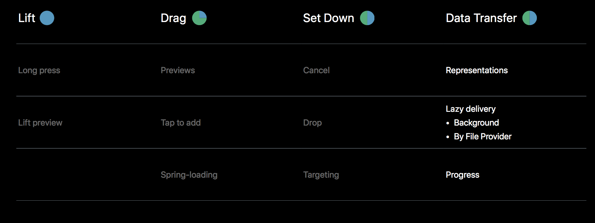
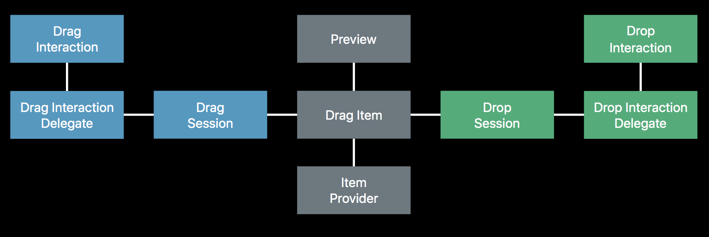
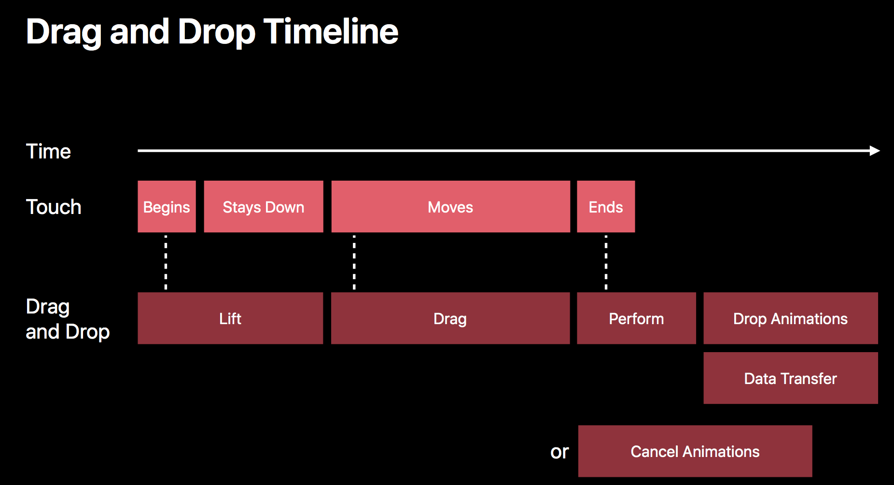
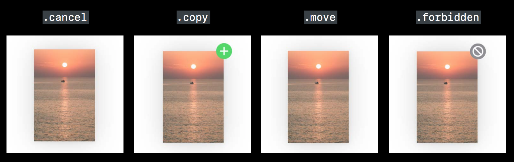

# WWDC 2017 - Introducing Drag and Drop


## 기본 컨셉

#### Drag and Drop이란?
그래픽적으로 데이터를 옮기거나 복사하기 위한 방법.

##### 목표
-Responsive  
 요구에 수용하며 비동기적으로 데이터를 전송

-Secure  
 데이터는 오직 목적지에서만 보여지며 접근을 제한할 수 있음

-A great Multi-Touch experience   
 여러개의 아이템을 전달하는 경우 사용됨


##### Drag and Drop의 단계


Lift - Long press를 통해 해당 item의 preview를 들어올린다.

Drag - Tap을 통해 여러개의 Item들을 Drag할 수 있다.

Set Down - Drag이후 내려놓고자하는 경우 Cancel이 가능하며 해당 Target에 Drop할 수 있다.

Data Transfer - 성공적으로 Drop되면 Background에서 동작되며 File Provider에 의해 Drag한 item을 Lazy하게 전달할 수 있다.


###### -Enabling Drag  
View에 Drag Interaction, Drag Interaction Delegate을 추가하여 Drag를 가능하게 한다.
###### -Lift 단계  
delegate는 view가 들어올려지면 drag하는 item들을 제공한다. 이때 item들이 없을 경우엔 drag 제스쳐를 실패처리한다.
###### -Drag 하는 item들  
모델 객체를 표현하며 Drag하는 item의 preview와 Item Provider를 가지고 있다.
###### -Enabling Drop  
UIResponders에 새롭게 추가되는 paste configuration를 통해 가능하다.
Drag와 마찬가지로 View에 추가된 Drop Interaction, Drop Interaction Delegate를 통해 가능하다.
###### -Drag를 하고 있는 동안  
Drop Proposal이 전달하는 drag events를 Delegate가 응답한다.
###### -Set Down 단계  
터치를 떼어버리면 Drag를 유지하는 session은 취소되고 다시 돌아간다.
Drop이 받아들여지면 perform drop을 delegate에게 요청한다.
###### -Data 전송 단계  
perform drop을 요청받은 delegate는 Drag Items에 내장되어있던 ItemProvider에게 data representation of items을 요청한다.
요청받은 ItemProvider는 비동기로 data를 전송한다.


## 필수 API

##### Begins
```sh
func dragInteraction(_ interaction: UIDragInteraction, itemsForBeginning         session:UIDragSession) -> [UIDragItem] { 
    let itemProvider = NSItemProvider(object: "Hello World" as NSString) 
    let dragItem = UIDragItem(itemProvider: itemProvider)

    return [ dragItem ] 
}
```
##### Moves
```sh
func dropInteraction(_ interaction: UIDropInteraction, sessionDidUpdate session: UIDropSession) -> UIDropProposal { 
    return UIDropProposal(operation: UIDropOperation) 
} 
```
##### DropOperation의 4가지 상태

- .copy와 .move에서 .copy는 앱과 앱간의 Drag and Drop, .move는 앱 내부에서의 Drag and Drop 이라는 점에서 차이를 갖는다.
- .move의 경우 Delegate에 의해 움직이는 것처럼 보이게하고 Drop interaction delegate는 UIDropSession allowsMoveOperation를 체크하며 움직임을 제어한다.

##### Ends - perform drop
- 단일 item인 경우
```sh
func dropInteraction(_ interaction: UIDropInteraction, performDrop session: UIDropSession) { 
    session.loadObjects(ofClass: UIImage.self) { objects in 
                for image in objects as! [UIImage] { 
                self.imageView.image = image 
                } 
        } 
} 
```
- 여러 item인 경우
```sh
func dropInteraction(_ interaction: UIDropInteraction, performDrop session: UIDropSession) { 
    for item in session.items { 
        item.itemProvider.loadObject(ofClass: UIImage.self) { (object, error) in 
            if object != nil { 
                DispatchQueue.main.async { self.imageView.image = (object as! UIImage)}
                        }else{
                                //handle the error
                        } 
                } 
        } 
}
```


## Drag Interaction Delegate

##### Lift
- 해당 item의 preview를 반환

```sh
func dragInteraction(_ interaction:UIDragInteraction, previewForLifting item:UIDragItem, session:UIDragSession) -> UITargetedDragPreview?
```
- animating 적용

```sh
func dragInteraction(_ interaction: UIDragInteraction, willAnimateLiftWith animator: UIDragAnimating, session: UIDragSession) 
```
##### session이 begin, move일 때
```sh
func dragInteraction(_ interaction: UIDragInteraction, sessionWillBegin session: UIDragSession) 

func dragInteraction(_ interaction: UIDragInteraction, sessionAllowsMoveOperation session: UIDragSession) -> Bool 

func dragInteraction(_ interaction: UIDragInteraction, sessionDidMove session: UIDragSession) 
```
##### session동안 tap을 통해 item을 추가할 때
```sh
func dragInteraction(_ interaction: UIDragInteraction, itemsForAddingTo session: UIDragSession, withTouchAt point: CGPoint) -> [UIDragItem] 

func dragInteraction(_ interaction:UIDragInteraction, previewForLifting item:UIDragItem, session:UIDragSession) -> UITargetedDragPreview? 
```
##### session이 끝날 때
```sh
func dragInteraction(_ interaction: UIDragInteraction, session: UIDragSession, willEndWith operation: UIDropOperation) 
```
##### session이 취소로 끝날 때
```sh
func dragInteraction(_ interaction: UIDragInteraction, previewForCancelling item: UIDragItem, withDefault defaultPreview: UITargetedDragPreview) -> UITargetedDragPreview? 

func dragInteraction(_ interaction: UIDragInteraction, item: UIDragItem, willAnimateCancelWith animator: UIDragAnimating) 

func dragInteraction(_ interaction: UIDragInteraction, session: UIDragSession didEndWith operation: UIDropOperation) 
```
##### session이 copy 또는 move로 끝날 때
```sh
func dragInteraction(_ interaction: UIDragInteraction, session: UIDragSession didEndWith operation: UIDropOperation)

func dragInteraction(_ interaction: UIDragInteraction, sessionDidTransferItems session: UIDragSession)
```


## Drop Interaction Delegate

##### session이 view에 진입시 item의 type 확인시 사용 가능
```sh
func dropInteraction(_ interaction: UIDropInteraction, canHandle session: UIDropSession) -> Bool 
```
##### session의 view 진입, 탈출시
```sh
func dropInteraction(_ interaction: UIDropInteraction, sessionDidEnter session: UIDropSession) 

func dropInteraction(_ interaction: UIDropInteraction, sessionDidUpdate session: UIDropSession) -> UIDropProposal

func dropInteraction(_ interaction: UIDropInteraction, sessionDidExit session: UIDropSession) 
```
##### session 종료시
```sh
func dropInteraction(_ interaction: UIDropInteraction, sessionDidEnd session: UIDropSession) 
```
##### drop animation
```sh
func dropInteraction(_ interaction: UIDropInteraction, previewForDropping item: UIDragItem, withDefault defaultPreview: UITargetedDragPreview) -> UITargetedDragPreview?

func dropInteraction(_ interaction: UIDropInteraction, item: UIDragItem, willAnimateDropWith animator: UIDragAnimating)
```
##### drop animation 종료시 
```sh
func dropInteraction(_ interaction: UIDropInteraction, concludeDrop session: UIDropSession) 
```
##### data 전송
```sh
let progress = item.itemProvider.loadObject(ofClass: UImage.self) { (object, error) in 
// 전송된 데이터나 오류를 받으면 동작한다.
} 
//progress의 상태를 체크
let fractionCompleted = progress.fractionCompleted 
let isFinished = progress.isFinished 
progress.cancel()  
let sessionProgress = session.progress 
```


